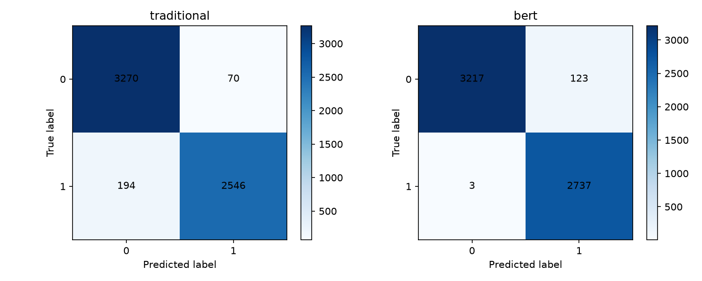
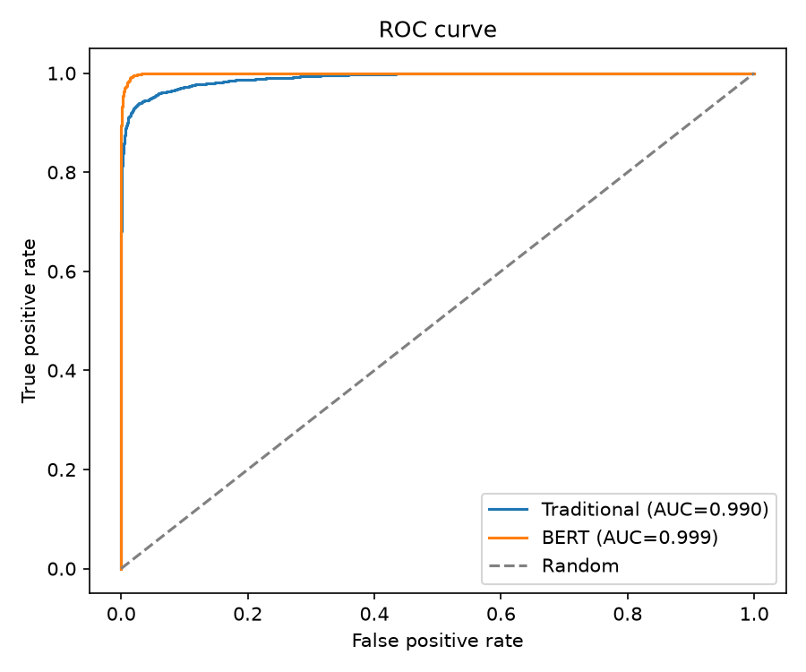

# 中文 AI 語句分析

本專案是一個中文 AI 文字風格分析的研究與展示 Demo，比較兩種二元分類方法：

1. **Traditional**：Character-level TF-IDF + Logistic Regression
2. **BERT**：以 `hfl/chinese-roberta-wwm-ext` 微調的本地分類模型

輸入一段中文後，系統會回傳 AI 風格傾向分數、Human／AI 機率、三段式判定、逐句結果、兩模型比較、文字統計，以及 Traditional 模型實際使用的 n-gram 判斷線索。

> 本工具估計的是文字與訓練語料的風格相似程度，不能證明作者是否使用 AI，也不應單獨用於學術判定、招聘或其他高風險決策

## 專案重點

- 針對中文改用 2～5 字元的 character n-gram，避免傳統 word-level TF-IDF 無法合理切分中文。
- 納入一般文本，以及刻意提高辨識難度的「像人類的 AI」與「像 AI 的人類」文本。
- 將資料正規化、去除完全相同文本，再以固定 seed 建立 70%／15%／15% 分層切分。
- 支援全文、逐句與長文本 BERT token 分塊分析。
- 使用「較偏向人類／無法確定／較偏向 AI」三段式結果，不把模型分數描述為作者身分證據。
- 提供 Gradio Demo、完整評估腳本、圖表、錯誤分析及輕量測試。

## 訓練資料集

### 蒐集與產生方式

資料由專案作者從不同平台蒐集，並自行透過 prompt 調適與 prompt engineering 產生及整理 AI 文本。AI 語料使用過的模型系列包括：

- GPT-4o
- GPT-4.5
- GPT-4 Turbo
- Gemini 1.0 Ultra
- Gemini 1.5 Pro
- Claude 3.5
- Llama 3.1
- Gemma

AI 類別不只包含容易辨認的制式回答，也刻意透過 prompt engineering 蒐集較口語、有個人細節、停頓或情緒表達的「像人類的 AI 文本」。

Human 類別除一般平台文本外，也納入文獻、報導、史料、參考書等具有正式或專業語句的內容，形成較容易被模型誤認為 AI 的「像 AI 的人類文本」。

### 難度設計

資料蒐集時依辨識難度佔比約為：

| 難度 | 比例 | 設計概念 |
|---|---:|---|
| 易 | 50% | 一般人類文本與具有明顯模板、拒答或條列風格的 AI 文本 |
| 中 | 35% | 風格差異較不明顯、較正式的人類文本或經過調整的 AI 文本 |
| 難 | 15% | 像人類的 AI 文本，以及來自文獻、報導、史料、參考書等像 AI 的人類文本 |


### Human／AI 統計

原始資料實際統計：

| 類別 | 標籤 | 原始筆數 | 原始占比 | 去重後筆數 | 去重後占比 |
|---|---:|---:|---:|---:|---:|
| Human | 0 | 22,263 | 54.93% | 22,263 | 54.93% |
| AI | 1 | 18,269 | 45.07% | 18,267 | 45.07% |
| 合計 |  | 40,532 | 100% | 40,530 | 100% |

資料沒有空文字；正規化後發現 2 筆重複 AI 文本，未發現相同文字具有衝突標籤。

固定 seed 42 的訓練切分：

| 集合 | 總數 | Human | AI | 用途 |
|---|---:|---:|---:|---|
| Train | 28,371 | 15,584 | 12,787 | 訓練 Traditional 模型 |
| Validation | 6,079 | 3,339 | 2,740 | 檢查模型與設定 |
| Test | 6,080 | 3,340 | 2,740 | Traditional 最終評估 |

三份資料之間沒有完全相同的正規化文本。完整資料說明見 [data/README.md](data/README.md)。原始 CSV 未納入 Git。

## 主要方法

### Character TF-IDF + Logistic Regression

```text
TfidfVectorizer(
    analyzer="char",
    ngram_range=(2, 5),
    min_df=3,
    max_features=50000,
    sublinear_tf=True
)

LogisticRegression(
    max_iter=2000,
    class_weight="balanced",
    random_state=42
)
```

兩個步驟以 scikit-learn `Pipeline` 儲存成單一模型。系統也會計算輸入中實際出現的 n-gram 對分類分數的正負貢獻；這些內容只是模型判斷線索，不是作者身分證據。

### Fine-tuned BERT

既有模型以 `hfl/chinese-roberta-wwm-ext` 為基礎，進行二元分類微調。推論時：

- 標籤 `0 = Human`、`1 = AI`。
- 自動使用 CUDA，沒有 CUDA 時改用 CPU。
- 檢查 missing、unexpected、mismatched keys，以及 NaN／Inf 權重。
- 超過模型長度的文章會切成 token chunks，再依有效 token 數加權，不直接丟棄後半段。

## 訓練與實驗流程

```text
CSV
 └─ Unicode／空白正規化
    └─ 移除空文本與完全相同文本
       └─ 70% Train / 15% Validation / 15% Test
          ├─ Character TF-IDF + Logistic Regression
          └─ 既有 fine-tuned BERT 載入與評估
```

Traditional 訓練程式只讀取 train，並在 validation 上回報訓練階段結果；test 只由 `evaluate.py` 最後評估。

BERT 必須另外說明：現有權重是在 notebook 中用另一套 80%／20% 切分訓練。重新比對後，目前 6,080 筆 test 中有 4,845 筆（79.69%）曾位於舊 BERT train split。因此下方 BERT 97.93% 是**模型載入與重跑參考結果，不是獨立 test 指標**。BERT 較可信的既有 holdout 紀錄是 notebook 原始 20% holdout 上約 97% accuracy／macro-F1，但只有四捨五入後的分類報告。

## 實驗結果

以下結果於 2026-03-14 實際重新執行。正類為 AI。

### Traditional：獨立 test set

| Accuracy | Precision | Recall | F1 | Macro-F1 | ROC-AUC | PR-AUC | 平均批次推論 |
|---:|---:|---:|---:|---:|---:|---:|---:|
| 95.66% | 97.32% | 92.92% | 95.07% | 95.60% | 99.05% | 99.01% | 0.36 ms/筆 |

混淆矩陣：TN 3270、FP 70、FN 194、TP 2546。

### BERT：重跑參考結果

| Accuracy | Precision | Recall | F1 | Macro-F1 | ROC-AUC | PR-AUC | 平均批次推論 |
|---:|---:|---:|---:|---:|---:|---:|---:|
| 97.93% | 95.70% | 99.89% | 97.75% | 97.91% | 99.91% | 99.90% | 75.55 ms/筆 |

混淆矩陣：TN 3217、FP 123、FN 3、TP 2737。因前述 split overlap，此表不能和 Traditional 的獨立 test 結果做完全對等的泛化比較。





### `my_data.csv`：口語化 AI 單類別測試

`my_data.csv` 原始 300 筆皆為 AI，去重後為 286 筆。因為沒有 Human 類別，只回報 AI recall 與分數分布，不稱為完整 accuracy。

| 模型 | AI recall @ 0.5 | AI 分數平均 | AI 分數中位數 | 無法確定 | 判為較偏向人類 |
|---|---:|---:|---:|---:|---:|
| Traditional | 23.08% | 38.40% | 35.98% | 44.41% | 47.20% |
| BERT | 100.00% | 99.94% | 99.95% | 0.00% | 0.00% |

這個結果顯示兩模型對口語化 AI 文本的反應差異很大，也說明單一內部分割的高分不能直接代表所有平台、模型或 prompt 下的真實表現。

完整數值與不含原文的彙總錯誤分析見：

- [實驗設計與結果說明](docs/EXPERIMENTS.md)
- [metrics.json](reports/metrics.json)
- [model_comparison.csv](reports/model_comparison.csv)
- [error_analysis.md](reports/error_analysis.md)

## 快速開始

建議使用 Python 3.11。

```bash
python -m venv venv
venv\Scripts\activate
pip install -r requirements-bert.txt
python train_baseline.py
python evaluate.py
python -m pytest -q
python app.py
```

啟動後開啟 `http://127.0.0.1:7860`。只使用 Traditional 時可改裝較小的 `requirements.txt`。

更完整的 Windows／Linux 安裝、參數、模型放置與操作方式見 [docs/USAGE.md](docs/USAGE.md)。

## 專案結構

```text
app.py                 Gradio Demo
train_baseline.py      Traditional 訓練入口
baseline.py            舊版 word-level baseline（保留供比較）
evaluate.py            評估與報表產生
src/                   資料處理與模型推論
tests/                 輕量測試
data/                  格式範例與資料說明
models/                本地模型與放置說明
reports/               實際評估結果及圖表
notebooks/             BERT 微調紀錄
docs/                  詳細操作與實驗說明
```

## 已知限制

- 現有 CSV 沒有記錄逐筆來源、模型、prompt 或難度欄位，不能重算難度比例或分析各來源表現。
- 蒐集自外部平台、文獻、報導、史料與參考資料的內容，仍須依原始來源的授權及使用條款處理；完整資料不隨公開 Repo 發布。
- 模型可能學到固定句型、格式、URL 或資料來源特徵，而非穩定的 AI 作者特徵。
- 目前只能避免完全相同文本洩漏，不能排除近似重複、共同來源或共同模板。
- 0.35／0.65 是保守的經驗門檻，尚未做正式機率校準。
- 短文本、人工改寫、新模型、新 prompt、不同中文地區用語或跨時間資料可能產生明顯分布偏移。

## 授權

本專案自行撰寫的程式碼與文件以 [MIT License](LICENSE) 授權。該授權不涵蓋未隨 Repo 發布的原始資料、第三方文本、基礎模型、tokenizer 或模型權重；使用者仍須遵守各資料與模型來源的授權及使用條款。
